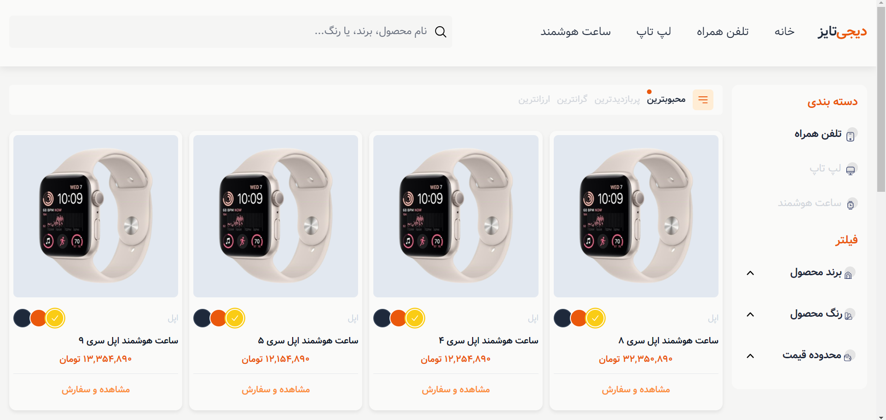
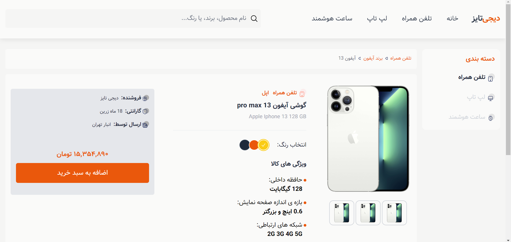
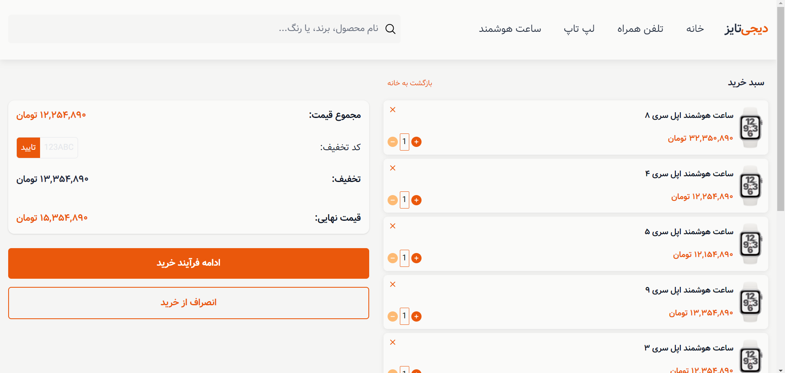

# Digitize Website Redesign Project

## App Demo





---

## Description

This Project is a Redesign of the User Interface(UI) of the Digitize Website, which is Responsive in the Screen Sizes of Different Devices;

This Simple Project was Developed Based on a Design in Figma, in which the Tailwind/forms Plugin was Used and we Created Dynamic Elements and Styles through the Alpine Library, the Speed of Work by the Tailwind Framework is very high and it results in an Optimal Output.

## Getting Started 🚀

To get started with this project, follow these steps:

1. Clone this repository to your local machine:

   ```bash
   git clone https://github.com/your-username/Digitize-Website-Redesign-TailwindCSS.git

   ```

2. Open the project folder in your code editor.

3. Explore the Public folder and check HTML files to understand the project structure and styling.

4. Note that in order to apply Tailwind styles, be sure to enter the following command in the terminal editor:

   ```bash
   npm run dev
   ```

## Usage 📋

- Customize the project to match your specific requirements.
- Add your own content and images.
- Test the responsiveness on various devices and browsers.

## Features

- Creating a Shop Page (Products Page) (TailwindCSS Framework)
- Creating a Single-Product Page (TailwindCSS Framework)
- Creating a Cart Page (TailwindCSS Framework)
- Creating an BreadCrumb Section (TailwindCSS Framework)
- Creating an Accordion Menu (Alpine.js)
- Create Professional Responsive Pages using TailwindCSS Framework
- Creating Styles and Dynamic Elements using Alpine.js

## Tips 📌

- Fully Responsive for Mobile, Tablet, Laptop and Desktop.

## Web Development Technologies

- HTML5 (Semantic HTML)
- TailwindCSS (FlexBox & Grid Layout)
- Alpine.js

## Contact Me 📧

<p>
<a href="https://t.me/Farzin_KHI" target="_blank"></a> <a href="mailto:khosravii.farzin@gmail.com" target="_blank"></a>

</p>
